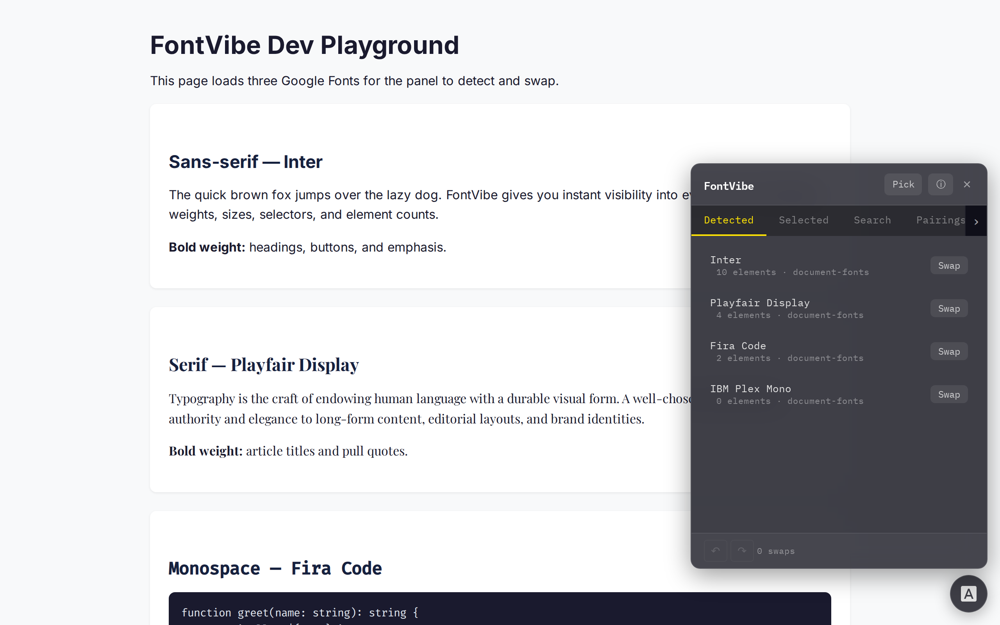
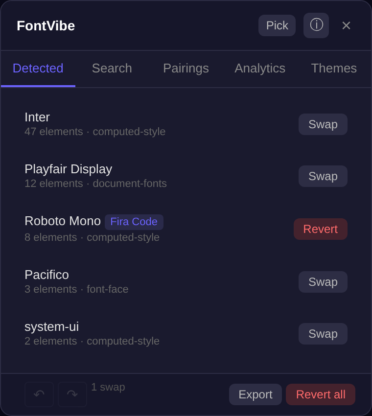
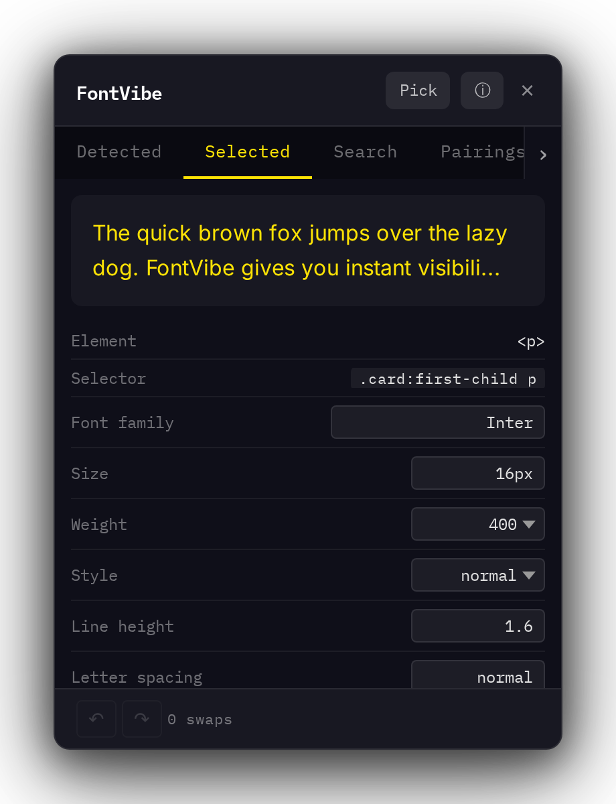
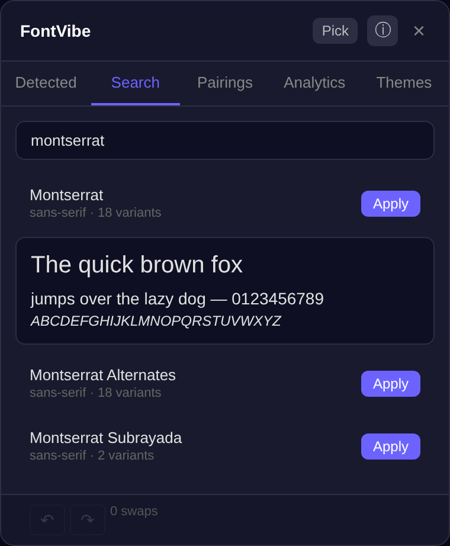
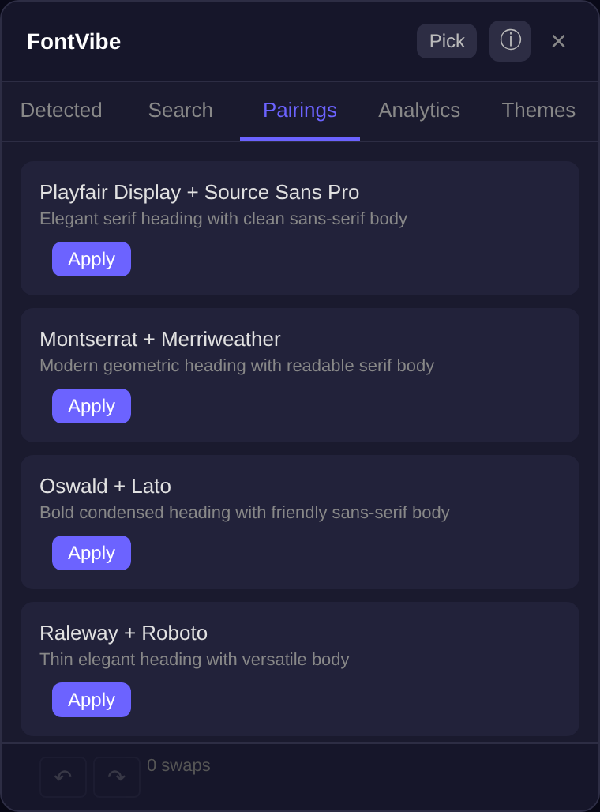
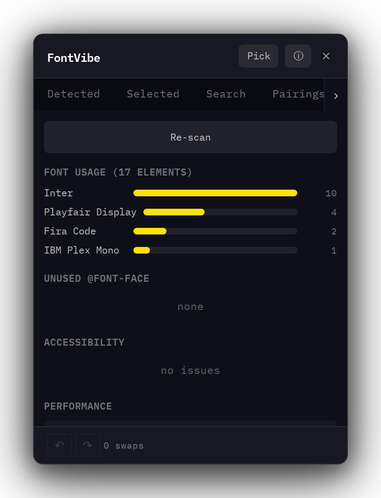
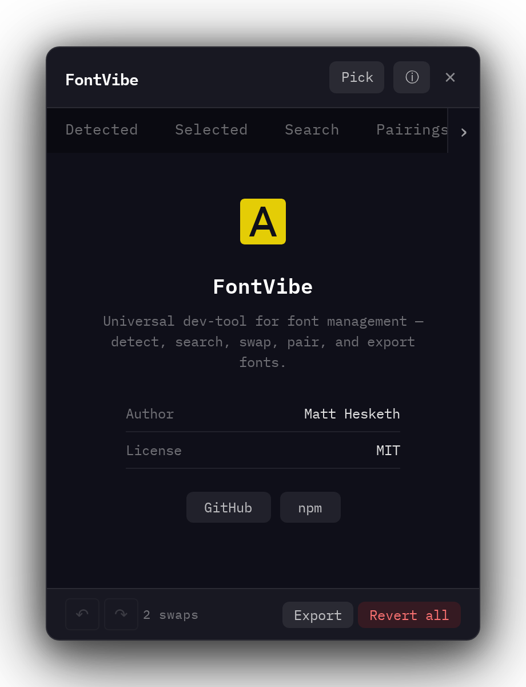

# FontVibe

Universal dev-tool for font management. Detect fonts on any website, search Google Fonts, swap fonts live, get pairing suggestions, and export CSS. Works with any dev server (Vite, Next.js, etc.) and supports MCP for AI agent integration.

<p align="center">
  
</p>

## Install

```bash
npm install fontvibe
```

## Quick Start

### 1. Get a Google Fonts API key

Get one from [Google Cloud Console](https://console.cloud.google.com/apis/credentials) with the Google Fonts Developer API enabled.

### 2. Set up config

```bash
npx fontvibe init
```

This creates a `.fontviberc` file with your API key and preferences.

### 3. Add to your app

**React:**

```tsx
import { FontVibe } from 'fontvibe/react';

function App() {
  return (
    <>
      <FontVibe apiKey="your-api-key" />
      {/* your app */}
    </>
  );
}
```

**Vanilla JS:**

```ts
import { fontvibe } from 'fontvibe';

fontvibe.mount({ apiKey: 'your-api-key' });
```

**Vite plugin:**

```ts
// vite.config.ts
import { fontvibe } from 'vite-plugin-fontvibe';

export default {
  plugins: [
    fontvibe({ apiKey: 'your-api-key' }),
  ],
};
```

The panel automatically hides in production (`NODE_ENV=production`).

## Features

A Shadow DOM panel that sits on top of your page with seven tabs:

<table>
  <tr>
    <td align="center">
      <br />
      <strong>Detected</strong><br />
      <sub>Fonts found via document.fonts, computed styles, and @font-face rules</sub>
    </td>
    <td align="center">
      <br />
      <strong>Selected</strong><br />
      <sub>Pick any element to inspect and edit its font properties live</sub>
    </td>
  </tr>
  <tr>
    <td align="center">
      <br />
      <strong>Search</strong><br />
      <sub>Search Google Fonts with live preview on hover, apply in one click</sub>
    </td>
    <td align="center">
      <br />
      <strong>Pairings</strong><br />
      <sub>Curated heading + body font pairing suggestions</sub>
    </td>
  </tr>
  <tr>
    <td align="center">
      <br />
      <strong>Analytics</strong><br />
      <sub>Font usage analysis, accessibility checks, and performance ratings</sub>
    </td>
    <td align="center">
      <br />
      <strong>Themes</strong><br />
      <sub>Save, load, and manage font theme presets</sub>
    </td>
  </tr>
  <tr>
    <td align="center" colspan="2">
      <br />
      <strong>About</strong><br />
      <sub>Author info and project links</sub>
    </td>
  </tr>
</table>

### Font Swapping

Click any detected font to swap it with a Google Font. Swaps inject a `<link>` to load the font and a `<style>` with targeted `!important` overrides. Fully reversible.

### Element Picker

Click "Pick" in the panel header to activate a crosshair cursor. Click any element on the page to inspect its full CSS font properties, then edit them live.

### Font Preview on Hover

Hovering over a search result loads the font from Google Fonts and shows a live preview with sample text at multiple sizes.

### Variable Font Support

Detected variable fonts show collapsible axis sliders (weight, width, slant, optical size). Adjust values and see changes applied live via `font-variation-settings`.

### Font Usage Analytics

Click "Scan" in the Analytics tab for a deep analysis of every font on the page:

- **Usage bars** -- element count per font family
- **Unused @font-face** -- declared but never used font faces
- **Accessibility checks** -- warnings for thin weights on body text, small font sizes, and decorative fonts used for body copy
- **Performance ratings** -- estimated download size and green/amber/red badges based on variant count

### Drag-and-Drop Local Fonts

Drag `.woff2`, `.woff`, `.ttf`, or `.otf` files onto the panel to inject them as `@font-face` declarations and apply them instantly.

### Undo / Redo

All swap operations are tracked in a history stack. Use the undo/redo buttons in the footer or keyboard shortcuts:

- **Undo**: `Ctrl+Z` / `Cmd+Z`
- **Redo**: `Ctrl+Y` / `Cmd+Shift+Z`

### Theme Presets

Save your current set of font swaps as a named theme. Themes persist in localStorage and can be applied, deleted, or exported/imported as JSON.

### Persistence

Active swaps are saved to `localStorage` and restored on page reload.

### CSS Export

Click "Export" to get a ready-to-use CSS snippet with `@import` and font-family rules for all active swaps.

## MCP Server

FontVibe includes an MCP server so AI agents can manipulate fonts on the page.

```bash
npx fontvibe mcp
```

This starts a stdio MCP server and a WebSocket bridge on `localhost:24242`. The browser panel connects automatically.

### MCP Tools

| Tool | Description | Browser Required |
|------|-------------|:---:|
| `fontvibe_list_fonts` | List detected fonts from the browser | Yes |
| `fontvibe_search_google_fonts` | Search Google Fonts by name or category | No |
| `fontvibe_apply_swap` | Swap a font on the page | Yes |
| `fontvibe_revert_swap` | Revert a specific swap | Yes |
| `fontvibe_revert_all` | Revert all swaps | Yes |
| `fontvibe_get_state` | Get current state (swaps + detected fonts) | Yes |
| `fontvibe_set_combination` | Apply multiple swaps at once | Yes |
| `fontvibe_suggest_pairings` | Get pairing suggestions | No |
| `fontvibe_get_analytics` | Analyse font usage on the page | Yes |
| `fontvibe_save_theme` | Save current swaps as a named theme | Yes |
| `fontvibe_list_themes` | List all saved themes | Yes |
| `fontvibe_apply_theme` | Apply a saved theme by ID | Yes |
| `fontvibe_screenshot_diff` | Capture page screenshot (requires puppeteer-core) | No |
| `fontvibe_import_figma` | Import font usage from a Figma file | No |

## Packages

| Package | Description |
|---------|-------------|
| `fontvibe` | Core library -- panel, detection, swapping, MCP |
| `vite-plugin-fontvibe` | Vite plugin -- auto-injects FontVibe panel in dev mode |

## API

### Core exports

```ts
import {
  mount,
  destroy,
  detectFonts,
  searchGoogleFonts,
  googleFontUrl,
  applySwap,
  revertSwap,
  revertAllSwaps,
  suggestPairings,
  getAllPairings,
  analyseFonts,
  selectorFor,
  checkAccessibility,
  getFontPerfData,
  detectVariableAxes,
  applyVariationSettings,
  saveTheme,
  listThemes,
  deleteTheme,
  getTheme,
  exportThemes,
  importThemes,
  fetchFigmaFonts,
} from 'fontvibe';
```

### Config options

```ts
interface FontVibeConfig {
  apiKey: string;
  wsPort?: number;          // default: 24242
  position?: PanelPosition; // default: 'bottom-right'
  defaultTab?: 'detected' | 'search';
  persistSwaps?: boolean;   // default: true
}

type PanelPosition = 'bottom-right' | 'bottom-left' | 'top-right' | 'top-left';
```

### Types

```ts
import type {
  FontVibeConfig,
  DetectedFont,
  GoogleFont,
  FontSwap,
  FontPairing,
  FontVibeState,
  PanelPosition,
  FontAnalytics,
  AnalyticsReport,
  VariableAxis,
  VariableFontInfo,
  A11yIssue,
  FontPerfData,
  LocalFont,
  HistoryEntry,
  FontTheme,
  FigmaFontUsage,
} from 'fontvibe';
```

## CLI

```
fontvibe init    Create .fontviberc config file
fontvibe mcp     Start MCP server with WebSocket bridge
```

## Figma Integration

Import font usage from any Figma file:

```ts
import { fetchFigmaFonts } from 'fontvibe';

const fonts = await fetchFigmaFonts('your-file-key', 'your-figma-token');
// [{ family: 'Inter', style: 'Regular', nodeCount: 42 }, ...]
```

Also available as the `fontvibe_import_figma` MCP tool.

## Browser Extension

The browser extension bundles FontVibe as a content script that works on any website. Install from `packages/browser-extension/`:

1. Build: `npm run build`
2. Load unpacked extension in Chrome (`chrome://extensions`)
3. Enter your Google Fonts API key in the popup
4. FontVibe panel appears on every page

## Development

```bash
npm install
npm run build
npm run dev     # dev server with live panel
npm test        # run tests
```

## Author

**Matt Hesketh** -- [GitHub](https://github.com/wrxck)

## License

MIT
